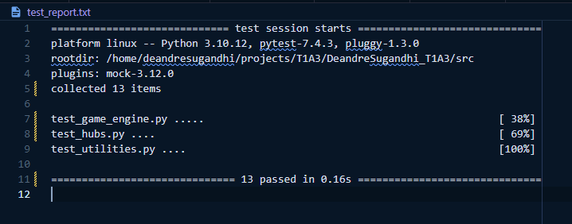
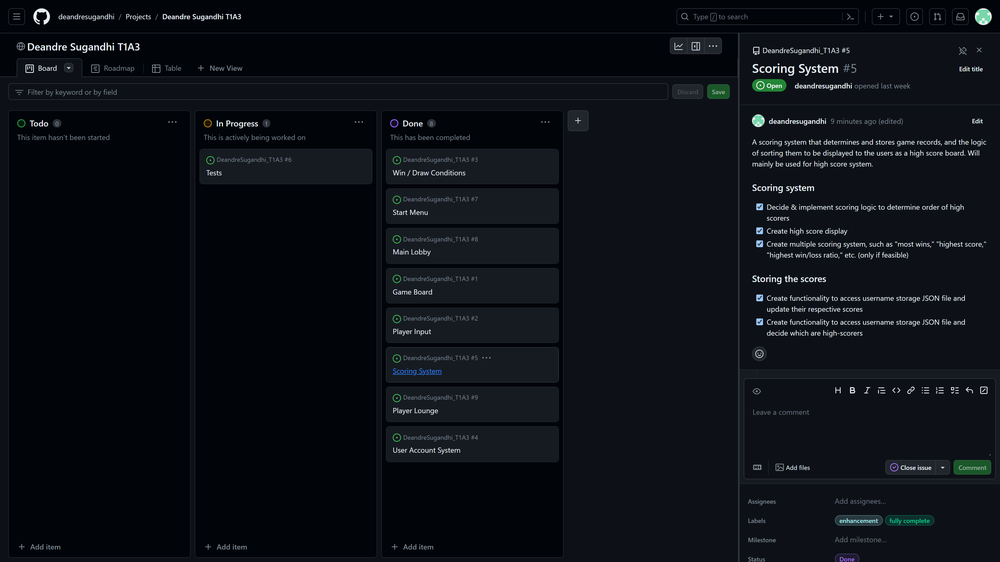
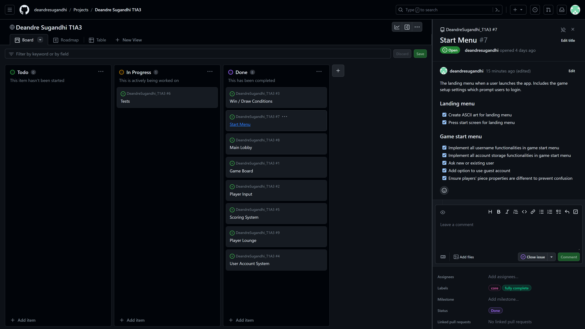

# T1A2 Porfolio Assignment

### Student: Deandre Sugandhi

[Github Repository](https://github.com/deandresugandhi/DeandreSugandhi_T1A3)

[Source Control Repository](https://github.com/deandresugandhi/DeandreSugandhi_T1A3/commits/main)

[Implementation Plan](https://github.com/users/deandresugandhi/projects/1)

## Table of Contents

- [Style Guide](#style-guide)
- [Features & Functionalities](#features--functionalities)
- [Implementation Plan](#implementation-plan)
- [Help](#help)
- [More Screenshots](#more-screenshots)
- [References](#references)

## Style Guide

This application follows the code conventions suggested in the [PEP 8](https://peps.python.org/pep-0008/) style guide for Python code (van Rossum, et al., 2023). [Pylint](https://pypi.org/project/pylint/) and its [Visual Studio Code extension](https://marketplace.visualstudio.com/items?itemName=ms-python.pylint) is used to help maintain consistent adherence to PEP 8 (LogiLab & Pylint Contributors, 2023). However, there are a few instances where PEP 8 suggestions are intentionally not being applied to the code. While most of the code is limited to 79 characters per line, as suggested by van Rossum, et al., (2023) (PEP 8), some lines of code are longer than this, as based on personal judgement, they would not be as readable or function as intended if separated into multiple lines.

## Features & Functionalities

__Terminal Connect Four__ is a terminal application for playing the traditional __Connect Four™️__ game (Hasbro, Inc., 2023), with several added functionalities.

### Connect Four Match

The feature generates a __Connect Four™️__ (Hasbro, Inc., 2023) board and game pieces for a PvP (Player vs Player) match between 2 players. The match follows the traditional rule of __Connect Four™️__ (Hasbro, Inc., 2023), using the standard-size game board (7 columns and 6 rows) and winning conditions (4 pieces stacked horizontally, vertically, or diagonally). Players take turns placing their pieces on the board by inputting a column number to drop their pieces in until a winning or game draw condition is met.

The players are also able to input two additional commands in addition to a column number for dropping pieces. __"Clear"__ simulates the slider underneath a traditional __Connect Four™️__ board (Hasbro, Inc., 2023), which clears the board of all its pieces effectively resetting the game state. __"Surrender"__ allows a player to forfeit a match and grant automatic victory to the other player. Game records are then recorded into the user accounts the players' are logged into, unless guest accounts are used (see below).

### User Account System

The feature allows a user to create their own account to store personal game data such as total games played, wins, losses, win ratio, piece color, piece type, etc. User data is stored in a JSON file named __"users.json"__ located in the root directory, in the form of a list, where each element is a dictionary representing a user account storing each unique user's information.

At the start of the game, before being able to access the game's main features, both players are prompted to setup their accounts. They can either login to their existing personal accounts, create new personal accounts, or use guest accounts which do not have full access to the functionalities of the game such as piece customization, game statistics, etc. Creating personal accounts requires users to input a unique username (with a specific format) and a four-digit PIN for registration. Username / PIN will be refused (errors are raised and handled accordingly) if either one is in an invalid format or the username is already associated with another account. The program also stores the login status of each user account, meaning that a player cannot attempt to login to an account that is already currently logged in.

_Notes: For now, account information including username and PIN are not encrypted when stored into the JSON file. This means that anyone having access to the JSON file can easily read all account information. This warning is displayed in-game when a user attempts to create a personal account._

### High Score System

The __high-score system__ is a feature that gathers game records from the JSON file and sorts them in descending order based on a keyword inputted by the player accessing it. Players can then view the top 5 user accounts with most games played, most wins, or highest win ratio. The top users' username, games played, wins, losses, and win ratio details are shown. Guest accounts can access this feature but are not included in it as their game histories are not recorded into the JSON file.

### Customizable Piece

Players can choose to customize how their game pieces are displayed on the game board during matches. This includes the piece type and piece color. The piece type is any single alphanumeric character chosen by the player that will be used to represent their game piece on the board, while the piece color defines the text color of the alphanumeric character. Players on a match are allowed to have the same piece color or piece type, but not both, to prevent confusion; if such a case is detected, the players are prompted to make changes to their piece properties. Players using guest accounts cannot access the piece customization feature, using the default guest account properties of __white__ __"O"__ piece for player 1 and __white__ __"X"__ piece for player 2.

### Player Lounge

The game implements a class of objects called __GameHub__, which represents lobbies or hubs with a selection of features that a user can enter and access. Each have unique ASCII art visual representations resembling a room or corridor. The __Player Lounge__ is one such hub, with accessible features including piece customization, high-score board, and user information kiosk.

#### Piece Customization

This is where players can access the __piece customization__ feature available for personal accounts only. Players are shown a preview of how their piece will look like before confirming their decision.

#### High-Score Board

This is where players can access the __high-score system__ feature. Players input a keyword for the sorting process, after which top 5 users information will be displayed in the form of an ASCII art board.

#### User Information Kiosk

The __user information kiosk__ is a feature that allows players to input any username and see their game statistics if there is an account associated with it. Information displayed include games played, wins, losses, and win ratio.

### Main Lobby

The main lobby is a __GameHub__ that acts as the landing area after both players have logged into an account. This is the hub from which the players can choose to start a Connect Four match, enter the __Player Lounge__, login to a different account, or exit the game.

### Tests

The test is executed for some of the most important functions and methods of the app, including those in game_engine.py, hubs.py, and utilities.py. [Pytest](https://docs.pytest.org/en/7.4.x/) is used to conduct the tests, and mocks are made using Pytest's [monkeypatch](https://docs.pytest.org/en/7.1.x/how-to/monkeypatch.html) (Krekel, et al., 2015). Test files are commented to explain why and how the test is executed. Report on the successful test results can be found in __test_report.txt__ in the root directory. Because the test depends on the user records stored in __users.json__ as of the time of test, it might not work in the future if __users.json__ has been modified such as by generating new users, changes in game records from playing matches, etc.



### Flowchart

This is the rough flowchart of how the features work together in general:


## Implementation Plan

To track the development of this application, I used [GitHub Projects](https://docs.github.com/en/issues/planning-and-tracking-with-projects/learning-about-projects/about-projects) as my project management platform (Github, Inc., 2023). First, I created a separate card for each feature of the application. Then, I created a list of tasks using checkboxes for each feature. Throughout this process, what is included in each card is reorganized to make it feel more intuitive; as a result, for example, some features are combined into a single card, while some tasks that are connected or shared between multiple features get their own separate cards. In other words, for this project, each card does not necessarily represent each separate feature of the game, but rather a group of connected tasks. For instance, the __Customizable Piece__ feature and the game board from the __Connect Four Match__ feature are combined into a single card called __Game Board__, which represents the objects involved in a physical __Connect Four™️__ game (Hasbro, Inc., 2023), namely the piece and the board. There is also a dedicated card called __Win / Draw Conditions__ despite it not being its own separate feature but a part of the __Connect Four Match__ feature, as I feel it is more helpful for me to separate the rules of the game from the game objects itself.

I used the GitHub project's default labels as well as my own custom labels to help prioritize each card, such as using a __core__ label for cards that is an integral part of the application, __enhancement__ label for cards with functionalities that enhances user experience and are thus optional depending on the time available until deadline, __core complete__ label for cards with all core tasks completed, and __fully completed__ label for cards with all tasks fully completed.

The __Roadmap__ and __Table__ view is helpful to add due dates and keep track of schedule, though in the end they are not really followed as my initial estimates of how long each card would take to complete turned out to be quite off, though it does help in deciding how to prioritize my time for each task. New features are also added as I work on the app and got new ideas, from which I checked the __Roadmap__ and due dates for each task; if I was well ahead of schedule, I would go on to try and implement the new features.

__Link to the GitHub implementation plan: [T1A3 GitHub Project](https://github.com/users/deandresugandhi/projects/1)__

__A more detailed, chronologically ordered series of screenshots can be accessed in the [More Screenshots](#more-screenshots) section of this document.__

### End State of Implementation Plan (Screenshots)

#### Game Board Card


#### Main Lobby Card


#### Player Input Card


#### Player Lounge Card


#### Scoring System Card



#### Start Menu Card



#### User Account System Card


#### Win-Draw Conditions Card


#### Roadmap View Card


#### Table View Card


## Help

### System Requirements

This application requires Python 3 to be installed in your system. If you haven't installed it already, refer to this [link](https://www.python.org/downloads/). To check if Python is installed in your system, run the following command in your terminal:

```
python --version
```

This should display the Python version installed on your system. Python 3.12 is recommended for this application. Refer to the link mentioned above if your Python version is lower.

The application also uses pip to install the application's dependencies. It should come bundled with Python 3.4 and newer versions. Otherwise, you might need to install it first. Refer to this [link](https://pip.pypa.io/en/stable/installation/) for installation instructions.

### Dependencies

This is the list of the application's dependencies. You can also find this list by opening "requirements.txt" in the applications's "src" directory.

```
art==6.1
colorama==0.4.6
exceptiongroup==1.1.3
iniconfig==2.0.0
maskpass==0.3.7
numpy==1.26.1
packaging==23.2
pluggy==1.3.0
pytest==7.4.3
pytest-mock==3.12.0
six==1.16.0
termcolor==2.3.0
tomli==2.0.1
```

### Installation

1. __Download Application:__

    - Open the [GitHub Repository](https://github.com/deandresugandhi/DeandreSugandhi_T1A3)
    - Click the green "Code" button on top of the page. There should be a "Download ZIP" option. Click on it to download the application's ZIP folder. 
    - You can also download the ZIP folder directly from this [link](https://github.com/deandresugandhi/DeandreSugandhi_T1A3/archive/refs/heads/main.zip).
    - Make sure to extract the folder to a path of your choice after downloading.

2. __Run Application:__

    - Open a new Terminal window.
    - Navigate to the DeandreSugandhi_T1A3 folder. This will depend on your system and where your file is located. It may look something like this:

        ```
        cd C:/Users/YourName/Downloads/DeandreSugandhi_T1A3
        ```

    - From this directory, enter the following command:

        ```
        ./run.sh
        ```

        If Python 3 and pip are installed correctly, the command will create and activate a virtual environment for the application to run on, and all dependencies will be automatically installed. The application will then run.
        
        However, if permission error occurs, enter the following command:

        ```
        chmod +x ./run.sh
        ```

        This should fix the permission error. You can then enter __./run.sh__ again and it should work as expected.
    
    - If you are using Windows, and are unable to proceed with __./run.sh__ or __chmod +x__, run the following command instead:

        ```
        bash run.sh
        ```

        In case of permission error, run this first before running bash run.sh again:

        ```
        icacls run.sh /grant Everyone:RX
        ```


3. __Installing dependencies (if not done automatically)__

    - While dependencies should be automatically installed when you run __run.sh__, in case of error, you can create a virtual environment and install the dependencies manually. First, make sure you are in the DeandreSugandhi_T1A3 directory. Then run the following command to create a virtual environment:

        ```
        python3 -m venv venv
        ```

        Then run the following command to activate the virtual environment:

        ```
        source venv/bin/activate
        ```

    - Install the dependencies using the following command:

        ```
        pip install {name of package}
        ```

        Substitute __{name of package}__ with the name of package that needs installing (such as __art==6.1__). See __Dependencies__ above for the list of packages that need to be installed.

4. __Playing the game__
    
    - Everytime you are required to input a command, the game will show a prompt that guides you on what commands are available and what you need to type in. For example, the following prompt __(y / n)__ means that you can type in "y" or "n" into your terminal (without the quotation marks) as a valid input.
    - Press the __enter__ button on your keyboard after you type in a valid input based on the prompt to input your command. The game will read your input, and will proceed as appropriate.
    - For most of the input you type in (with the exception of case sensitive inputs such as username or piece type), it would be recommended to type in all lowercase letters. While the application will convert all your inputs into lowercase letters anyway if it requires the format to be so, it would be recommended to manually type in lower case to prevent unexpected errors. Again, remember that this does not apply to inputs that are supposed to be case sensitive.
    - Please do not attempt to modify __users.json__ in any way other than from the in-game commands themselves. Modifying it can cause __users.json__ to be invalid, which will cause errors in the game. There are fail-safe measures to ensure __users.json__ is in the right format, but it can cause some user data to be deleted if the program detects any wrong formatting.

## More Screenshots

### Day 1


### Day 2


### Day 3


### Day 4


### Day 5


### Day 6


### Day 7


## References

Anifer, A., & Szkalka, B. (2022). _Maskpass_. https://pypi.org/project/maskpass/

Github, Inc. (2023). _About projects_. https://docs.github.com/en/issues/planning-and-tracking-with-projects/learning-about-projects/about-projects

Haghighi, S., & ART-Dev Team. (2023). _Art: ASCII Art Library for Python_. https://www.ascii-art.site/

Hartley, J., Yaari, A., & Colorama-Dev Team. (2020). _Colorama_. https://pypi.org/project/colorama/

Hasbro, Inc. (2023). _Connect 4 Game_. Hasbro Shop. https://shop.hasbro.com/en-au/product/connect-4-game/80FB5BCA-5056-9047-F5F4-5EB5DF88DAF4

Hukkinen, T & Tomli-Dev Team. (2021). _Tomli_. https://github.com/hukkin/tomli

Krekel, H., & Pytest-Dev Team. (2015). _Pytest_. https://docs.pytest.org/en/7.1.x/license.html

Krekel, H., & Pytest-Dev Team. (2016). _Pluggy: The pytest plugin system_. https://pluggy.readthedocs.io/en/stable/

LogiLab & Pylint Contributors. (2023). _Pylint_. https://www.pylint.org/

NumPy Developers. (2022). _NumPy_. https://numpy.org/doc/stable/index.html

Oliveira, B. (2022). _Pytest-mock_. https://pytest-mock.readthedocs.io/en/latest/

Peterson, B. (2020). _Six: Python 2 and 3 compatibility library_. https://six.readthedocs.io/

van Kemenade & Termcolor-Dev Team. (2023). _Termcolor_. https://github.com/termcolor/termcolor

van Rossum, Warsaw, B., & Coghlan, A. (2023). _Pep 8 - style guide for Python code._ Python Enhancement Proposals. https://peps.python.org/pep-0008/
